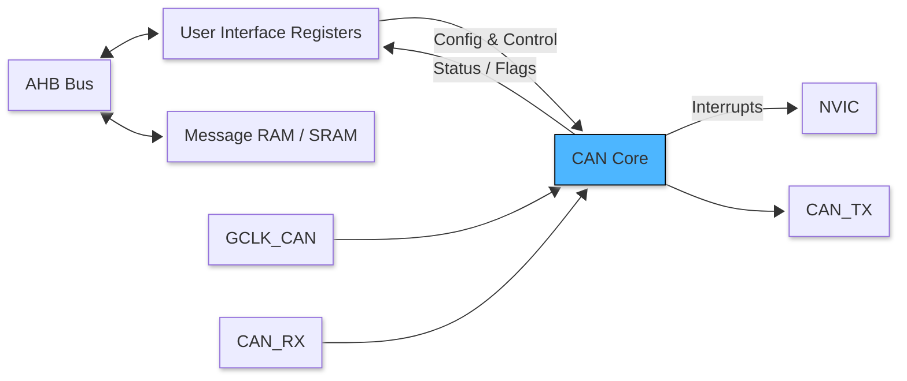

# CAN (Controller Area Network) – Bare‑Metal Learning Notes

This document is part of my **bare‑metal embedded systems learning repository**. It explains **CAN fundamentals**, **how CAN works internally**, and **how to approach CAN at register/driver level** without relying on vendor HAL libraries.

---

## 1. What is CAN?

**CAN (Controller Area Network)** is a **robust, multi‑master, message‑based serial communication protocol** widely used in **automotive, industrial, robotics, and medical systems**.

Key idea:

* Devices do **not talk to specific devices**
* Devices **broadcast messages**
* Any node that needs the data can accept it

> CAN is about *data relevance*, not *device addressing*.

---

## 2. Why CAN Exists (Problem It Solves)

Before CAN:

* Point‑to‑point wiring
* Huge wire harnesses
* Low reliability
* Difficult debugging

CAN provides:

* **2‑wire differential bus** (CAN_H, CAN_L)
* **High noise immunity**
* **Automatic arbitration**
* **Built‑in error detection**
* **Deterministic communication**

---

## 3. CAN vs UART / SPI / I2C

| Feature         | UART           | SPI          | I2C          | CAN            |
| --------------- | -------------- | ------------ | ------------ | -------------- |
| Topology        | Point‑to‑point | Master‑slave | Multi‑master | Multi‑master   |
| Addressing      | No             | CS lines     | 7/10‑bit     | Message ID     |
| Error detection | Minimal        | None         | ACK only     | CRC + counters |
| Arbitration     | No             | No           | Yes          | Yes (bitwise)  |
| Noise immunity  | Low            | Medium       | Medium       | High           |

---

## 4. Physical Layer Basics

CAN uses **differential signaling**:

* **Dominant bit (0)** → CAN_H ≈ 3.5V, CAN_L ≈ 1.5V
* **Recessive bit (1)** → CAN_H ≈ 2.5V, CAN_L ≈ 2.5V

Benefits:

* Rejects common‑mode noise
* Works reliably in harsh environments

> MCU **cannot directly drive CAN bus** → requires a **CAN transceiver** (e.g., MCP2551, TJA1050).

---

## 5. CAN Node Architecture

A CAN node consists of:

```
Application
   ↓
CAN Driver (Bare Metal)
   ↓
CAN Controller (MCU Peripheral)
   ↓
CAN Transceiver
   ↓
CAN Bus (CAN_H / CAN_L)
```


---

## 6. Message‑Based Communication

CAN does **not** use device addresses.

Instead, each frame contains a **Message Identifier (ID)**:

* Standard ID → 11‑bit
* Extended ID → 29‑bit

Lower ID = **higher priority**.

Example:

* 0x100 → Engine speed
* 0x200 → Temperature data

Any node interested in `0x100` listens for it.

---

## 7. CAN Frame Format (Classical CAN)

```
| SOF | ID | RTR | IDE | DLC | DATA | CRC | ACK | EOF |
```

### Field Explanation

* **SOF** – Start of frame
* **ID** – Message identifier
* **RTR** – Remote transmission request
* **DLC** – Data length (0–8 bytes)
* **DATA** – Payload
* **CRC** – Error detection
* **ACK** – Receiver acknowledgment
* **EOF** – End of frame

---

## 8. Arbitration (Most Important Concept)

CAN uses **bitwise arbitration** on the bus.

Rules:

* Dominant (0) overwrites recessive (1)
* If a node sends `1` but reads `0`, it **loses arbitration**
* Losing node stops transmitting and retries later

Result:

* No data corruption
* Highest priority message always wins

---

## 9. Error Handling in CAN

CAN has **strong fault tolerance**:

### Error Detection

* Bit monitoring
* Bit stuffing check
* Frame check
* CRC check
* ACK check

### Error Counters

* TEC (Transmit Error Counter)
* REC (Receive Error Counter)

### Node States

| State         | Description           |
| ------------- | --------------------- |
| Error Active  | Normal operation      |
| Error Passive | Limited transmission  |
| Bus‑Off       | Disconnected from bus |

---

## 10. CAN Bit Timing (Bare‑Metal Critical)

CAN bit time is divided into:

```
Sync_Seg | Prop_Seg | Phase_Seg1 | Phase_Seg2
```

Configured using:

* Prescaler
* Time segments
* Sample point

Incorrect timing = **no communication**.

---

## 11. CAN Filters & Mailboxes

### Mailboxes / Buffers

* TX mailboxes → transmit frames
* RX mailboxes → receive frames

### Acceptance Filters

* Decide **which IDs are accepted**
* Reduce CPU load

Bare‑metal drivers must:

* Configure filters correctly
* Clear RX flags manually

---

## 12. CAN Interrupts (Bare‑Metal View)

Typical interrupts:

* RX complete
* TX complete
* Error warning
* Bus‑off

Best practice:

* ISR should be **short**
* Copy data → process in main loop

---

## 13. Bare‑Metal CAN Driver Structure

 structure in repo:

```
can/
├── can.h          // Register definitions & APIs
├── can.c          // Initialization, TX, RX
├── can_isr.c      // Interrupt handlers
├── can_defs.h     // Bit masks, enums
```

---

## 14. Minimal CAN Driver Responsibilities

A bare‑metal CAN driver must:

* Enable CAN clock
* Configure bit timing
* Configure GPIO pins
* Setup filters
* Enable interrupts
* Handle error states

No HAL. No abstraction leaks.

---

## 15. Debugging CAN (Practical Tips)

* Always check **bus termination (120Ω)**
* Verify bit timing first
* Monitor error counters
* Use logic analyzer / CAN analyzer
* Test TX only → then RX

---

## 16. Where This Fits in My Repo

This CAN module complements:

* Bare‑metal clock setup
* NVIC & interrupts
* Peripheral driver design

Goal:

> Build **production‑grade low‑level drivers** with full protocol understanding.

---

## 17. Next Steps

Planned additions:

* Classical CAN driver example
* Loopback mode testing
* Error injection tests
* CAN vs CAN‑FD notes

---
